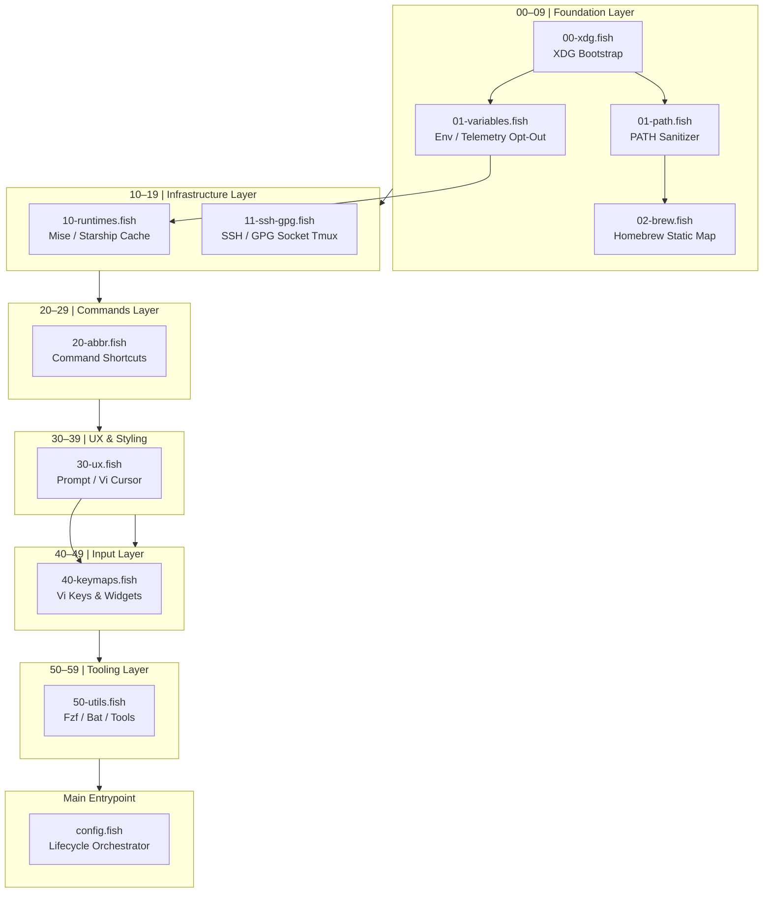

# Map of Content: Shell Configuration Architecture

This document serves as the central index (Map of Content) and semantic dependency registry for the Fish shell workstation configuration. It maps files to atomic configuration nodes within the agentic graph database, enabling automated discovery, runtime analysis, and self-healing validation.

---

## I. Architectural Topology

The execution sequence is split into a **Decade-Spaced Modular Topology** (processed lexicographically by the Fish shell during startup within `conf.d/`) followed by the main orchestrator (`config.fish`).



---

## II. Semantic Node Registry

Every file in this configuration contains a structured YAML-compliant comment block at the top representing metadata for programmatic ingestion.

| Node (File Path) | Title | Layer | Dependencies | Backlinks (Referrers) | Created | Updated | Tags |
| :--- | :--- | :--- | :--- | :--- | :--- | :--- | :--- |
| [`config.fish`](file:///Users/x0r/.config/fish/config.fish) | Main Configuration Entrypoint | Entrypoint / Orchestrator | `conf.d/*` | None | 2026-06-24 | 2026-07-05 | `entrypoint`, `lifecycle`, `bootstrap`, `orchestration` |
| [`conf.d/00-xdg.fish`](file:///Users/x0r/.config/fish/conf.d/00-xdg.fish) | XDG Base Directory Spec | Foundation (00-09) | None | [`config.fish`](file:///Users/x0r/.config/fish/config.fish), [`01-path.fish`](file:///Users/x0r/.config/fish/conf.d/01-path.fish), [`01-variables.fish`](file:///Users/x0r/.config/fish/conf.d/01-variables.fish) | 2026-06-24 | 2026-06-25 | `xdg`, `directory`, `bootstrap`, `wac` |
| [`conf.d/01-path.fish`](file:///Users/x0r/.config/fish/conf.d/01-path.fish) | Vectorized Native PATH Sanitization | Foundation (00-09) | [`00-xdg.fish`](file:///Users/x0r/.config/fish/conf.d/00-xdg.fish) | [`config.fish`](file:///Users/x0r/.config/fish/config.fish), [`02-brew.fish`](file:///Users/x0r/.config/fish/conf.d/02-brew.fish) | 2026-06-24 | 2026-07-12 | `path`, `sanitization`, `C++ builtins`, `performance`, `mise`, `shims` |
| [`conf.d/01-variables.fish`](file:///Users/x0r/.config/fish/conf.d/01-variables.fish) | Foundation Env Variables | Foundation (00-09) | [`00-xdg.fish`](file:///Users/x0r/.config/fish/conf.d/00-xdg.fish) | [`config.fish`](file:///Users/x0r/.config/fish/config.fish), [`10-runtimes.fish`](file:///Users/x0r/.config/fish/conf.d/10-runtimes.fish) | 2026-06-24 | 2026-06-25 | `variables`, `environment`, `telemetry`, `locale` |
| [`conf.d/02-brew.fish`](file:///Users/x0r/.config/fish/conf.d/02-brew.fish) | Homebrew Environment Mapping | Foundation (00-09) | [`01-path.fish`](file:///Users/x0r/.config/fish/conf.d/01-path.fish) | [`config.fish`](file:///Users/x0r/.config/fish/config.fish) | 2026-06-24 | 2026-06-25 | `homebrew`, `environment`, `performance`, `zero-fork` |
| [`conf.d/10-runtimes.fish`](file:///Users/x0r/.config/fish/conf.d/10-runtimes.fish) | Self-Healing Runtime Cache Engine | Infrastructure (10-19) | [`01-variables.fish`](file:///Users/x0r/.config/fish/conf.d/01-variables.fish) | [`config.fish`](file:///Users/x0r/.config/fish/config.fish) | 2026-06-24 | 2026-07-12 | `cache`, `runtimes`, `starship`, `mise`, `shims`, `performance` |
| [`conf.d/11-ssh-gpg.fish`](file:///Users/x0r/.config/fish/conf.d/11-ssh-gpg.fish) | SSH & GPG Crypto Infrastructure | Infrastructure (10-19) | None | [`config.fish`](file:///Users/x0r/.config/fish/config.fish) | 2026-06-24 | 2026-07-12 | `ssh`, `gpg`, `agent`, `security`, `tmux`, `lazy-tty` |
| [`conf.d/20-abbr.fish`](file:///Users/x0r/.config/fish/conf.d/20-abbr.fish) | Command Abbreviations Registry | Commands (20-29) | None | [`config.fish`](file:///Users/x0r/.config/fish/config.fish) | 2026-06-24 | 2026-07-12 | `abbreviations`, `shortcuts`, `productivity` |
| [`conf.d/30-ux.fish`](file:///Users/x0r/.config/fish/conf.d/30-ux.fish) | Shell Presentation & UX Layer | UX / UI (30-39) | None | [`config.fish`](file:///Users/x0r/.config/fish/config.fish), [`40-keymaps.fish`](file:///Users/x0r/.config/fish/conf.d/40-keymaps.fish) | 2026-06-24 | 2026-06-25 | `ux`, `cursor`, `prompt`, `history` |
| [`themes/colorscheme.fish`](file:///Users/x0r/.config/fish/themes/colorscheme.fish) | Cyberpunk Neon Color Palette | UX / UI (30-39) | None | [`config.fish`](file:///Users/x0r/.config/fish/config.fish) | 2026-06-24 | 2026-06-25 | `colorscheme`, `theme`, `cyberpunk`, `palette` |
| [`conf.d/40-keymaps.fish`](file:///Users/x0r/.config/fish/conf.d/40-keymaps.fish) | Keyboard Mappings & Vi Bindings | Input & Mappings (40-49) | [`30-ux.fish`](file:///Users/x0r/.config/fish/conf.d/30-ux.fish) | [`config.fish`](file:///Users/x0r/.config/fish/config.fish) | 2026-06-24 | 2026-06-25 | `keymaps`, `bindings`, `vi-mode`, `widgets` |
| [`conf.d/50-utils.fish`](file:///Users/x0r/.config/fish/conf.d/50-utils.fish) | Third-Party Tool Integrations | Tooling (50-59) | None | [`config.fish`](file:///Users/x0r/.config/fish/config.fish) | 2026-06-24 | 2026-07-12 | `tooling`, `fzf`, `bat`, `fd`, `tree-sitter` |
| [`conf.d/50-fzf.fish`](file:///Users/x0r/.config/fish/conf.d/50-fzf.fish) | Fzf Fuzzy Finder Configuration | Tooling (50-59) | None | [`config.fish`](file:///Users/x0r/.config/fish/config.fish) | 2026-06-26 | 2026-07-12 | `fzf`, `tooling`, `fuzzy-finder`, `xdg`, `cache` |
| [`bin/fzf-preview.sh`](file:///Users/x0r/.config/fish/bin/fzf-preview.sh) | Fzf Preview Handler Script | Tooling (50-59) | None | [`conf.d/50-fzf.fish`](file:///Users/x0r/.config/fish/conf.d/50-fzf.fish) | 2026-06-26 | 2026-06-26 | `fzf`, `preview`, `script` |
| [`functions/mise.fish`](file:///Users/x0r/.config/fish/functions/mise.fish) | Static Mise Wrapper Function | Infrastructure (10-19) | None | [`config.fish`](file:///Users/x0r/.config/fish/config.fish) | 2026-07-12 | 2026-07-12 | `mise`, `wrapper`, `performance` |
| [`functions/git.fish`](file:///Users/x0r/.config/fish/functions/git.fish) | Lazy GPG_TTY Git Wrapper | Functions | None | None | 2026-07-12 | 2026-07-12 | `git`, `gpg`, `wrapper`, `performance` |
| [`functions/gpg.fish`](file:///Users/x0r/.config/fish/functions/gpg.fish) | Lazy GPG_TTY GPG Wrapper | Functions | None | None | 2026-07-12 | 2026-07-12 | `gpg`, `wrapper`, `performance` |
| [`functions/gpg2.fish`](file:///Users/x0r/.config/fish/functions/gpg2.fish) | Lazy GPG_TTY GPG2 Wrapper | Functions | None | None | 2026-07-12 | 2026-07-12 | `gpg`, `gpg2`, `wrapper`, `performance` |
| [`functions/pass.fish`](file:///Users/x0r/.config/fish/functions/pass.fish) | Lazy GPG_TTY Pass Wrapper | Functions | None | None | 2026-07-12 | 2026-07-12 | `pass`, `gpg`, `wrapper`, `performance` |
| [`functions/micromamba.fish`](file:///Users/x0r/.config/fish/functions/micromamba.fish) | Lazy Micromamba Wrapper | Functions | None | None | 2026-07-12 | 2026-07-12 | `micromamba`, `conda`, `lazy`, `performance` |
| [`functions/mamba.fish`](file:///Users/x0r/.config/fish/functions/mamba.fish) | Lazy Mamba Wrapper | Functions | None | None | 2026-07-12 | 2026-07-12 | `mamba`, `lazy`, `performance` |
| [`functions/up.fish`](file:///Users/x0r/.config/fish/functions/up.fish) | Lazy Up Navigation Function | Functions | None | None | 2026-07-12 | 2026-07-12 | `navigation`, `helper` |
| [`functions/mkcd.fish`](file:///Users/x0r/.config/fish/functions/mkcd.fish) | Lazy Mkcd Directory Function | Functions | None | None | 2026-07-12 | 2026-07-12 | `navigation`, `management` |
| [`functions/mkcp.fish`](file:///Users/x0r/.config/fish/functions/mkcp.fish) | Lazy Mkcp Directory Copy Function | Functions | None | None | 2026-07-12 | 2026-07-12 | `filesystem`, `copy` |
| [`functions/mkmv.fish`](file:///Users/x0r/.config/fish/functions/mkmv.fish) | Lazy Mkmv Directory Move Function | Functions | None | None | 2026-07-12 | 2026-07-12 | `filesystem`, `move` |
| [`functions/cdf.fish`](file:///Users/x0r/.config/fish/functions/cdf.fish) | macOS Finder Path Jumper | Functions | None | None | 2026-07-12 | 2026-07-12 | `macos`, `navigation`, `finder` |
| [`functions/chmodx.fish`](file:///Users/x0r/.config/fish/functions/chmodx.fish) | Executable Permissions Helper | Functions | None | None | 2026-07-12 | 2026-07-12 | `permissions`, `chmod` |
| [`functions/chownme.fish`](file:///Users/x0r/.config/fish/functions/chownme.fish) | Ownership Modification Helper | Functions | None | None | 2026-07-12 | 2026-07-12 | `permissions`, `chown` |
| [`functions/fzf_find.fish`](file:///Users/x0r/.config/fish/functions/fzf_find.fish) | Fuzzy Finder File Searcher | Functions | None | None | 2026-07-12 | 2026-07-12 | `fzf`, `find` |
| [`functions/fd_find.fish`](file:///Users/x0r/.config/fish/functions/fd_find.fish) | fd-powered Fuzzy File Searcher | Functions | None | None | 2026-07-12 | 2026-07-12 | `fd`, `fzf`, `find` |
| [`functions/fo.fish`](file:///Users/x0r/.config/fish/functions/fo.fish) | Fuzzy Editor Launcher | Functions | None | None | 2026-07-12 | 2026-07-12 | `fd`, `fzf`, `editor` |
| [`functions/rg_find.fish`](file:///Users/x0r/.config/fish/functions/rg_find.fish) | ripgrep Fuzzy File Finder | Functions | None | None | 2026-07-12 | 2026-07-12 | `rg`, `fzf`, `search` |
| [`functions/Rg.fish`](file:///Users/x0r/.config/fish/functions/Rg.fish) | Interactive Fuzzy Ripgrep Search | Functions | None | None | 2026-07-12 | 2026-07-12 | `rg`, `fzf`, `interactive` |
| [`functions/TODOS.fish`](file:///Users/x0r/.config/fish/functions/TODOS.fish) | Fuzzy Codebase TODOs Selector | Functions | None | None | 2026-07-12 | 2026-07-12 | `rg`, `fzf`, `todos` |
| [`functions/ff.fish`](file:///Users/x0r/.config/fish/functions/ff.fish) | Recurse Name File Finder | Functions | None | None | 2026-07-12 | 2026-07-12 | `search`, `find` |
| [`functions/search.fish`](file:///Users/x0r/.config/fish/functions/search.fish) | Recursive Text Grep Shorthand | Functions | None | None | 2026-07-12 | 2026-07-12 | `search`, `grep` |
| [`functions/grep_string.fish`](file:///Users/x0r/.config/fish/functions/grep_string.fish) | Clipboard String Ripgrep Searcher | Functions | None | None | 2026-07-12 | 2026-07-12 | `search`, `clipboard`, `rg` |
| [`functions/gitf.fish`](file:///Users/x0r/.config/fish/functions/gitf.fish) | Fuzzy Git Tracked File Selector | Functions | None | None | 2026-07-12 | 2026-07-12 | `git`, `fzf`, `select` |
| [`functions/gituf.fish`](file:///Users/x0r/.config/fish/functions/gituf.fish) | Fuzzy Git Untracked File Selector | Functions | None | None | 2026-07-12 | 2026-07-12 | `git`, `fzf`, `select` |
| [`functions/gitlog.fish`](file:///Users/x0r/.config/fish/functions/gitlog.fish) | Fuzzy Git Commit History Browser | Functions | None | None | 2026-07-12 | 2026-07-12 | `git`, `fzf`, `log` |
| [`functions/gitbranch.fish`](file:///Users/x0r/.config/fish/functions/gitbranch.fish) | Fuzzy Git Branch Checkout Selector | Functions | None | None | 2026-07-12 | 2026-07-12 | `git`, `fzf`, `branch` |
| [`functions/fzf_preview.fish`](file:///Users/x0r/.config/fish/functions/fzf_preview.fish) | Fuzzy Multi-Mode Preview Browser | Functions | None | None | 2026-07-12 | 2026-07-12 | `fzf`, `preview`, `browser` |
| [`functions/mise-bootstrap.fish`](file:///Users/x0r/.config/fish/functions/mise-bootstrap.fish) | Mise Infrastructure Bootstrapper | Functions | None | None | 2026-07-12 | 2026-07-12 | `mise`, `bootstrap`, `infrastructure` |
| [`functions/refresh_shell_cache.fish`](file:///Users/x0r/.config/fish/functions/refresh_shell_cache.fish) | Cache Purge & Shell Reload Utility | Functions | None | None | 2026-07-12 | 2026-07-12 | `cache`, `reload`, `utility` |
| [`completions/micromamba.fish`](file:///Users/x0r/.config/fish/completions/micromamba.fish) | Micromamba Completions | Completions | None | None | 2026-07-12 | 2026-07-12 | `micromamba`, `completions`, `tab` |
| [`completions/mamba.fish`](file:///Users/x0r/.config/fish/completions/mamba.fish) | Mamba Completions Wrapper | Completions | None | None | 2026-07-12 | 2026-07-12 | `mamba`, `completions`, `tab` |
| [`functions/profile_startup.fish`](file:///Users/x0r/.config/fish/functions/profile_startup.fish) | Fish Startup Profiler Function | Functions | None | None | 2026-06-24 | 2026-07-12 | `profiling`, `performance`, `benchmark` |
| [`functions/tmx.fish`](file:///Users/x0r/.config/fish/functions/tmx.fish) | Ultimate Tmux Session Manager | Functions | `tmux`, `fzf` | [`conf.d/20-abbr.fish`](file:///Users/x0r/.config/fish/conf.d/20-abbr.fish) | 2026-06-25 | 2026-07-12 | `tmux`, `fzf`, `utility` |
| [`.meta/research_mise_shims.md`](file:///Users/x0r/.config/fish/.meta/research_mise_shims.md) | Systems Engineering Report on Mise | Meta / Logging | None | [`.agents/AGENTS.md`](file:///Users/x0r/.config/fish/.agents/AGENTS.md) | 2026-07-12 | 2026-07-12 | `research`, `mise`, `shims`, `performance` |
| [`.meta/research_startup_latency.md`](file:///Users/x0r/.config/fish/.meta/research_startup_latency.md) | Startup Latency Research Paper | Meta / Logging | None | [`.agents/AGENTS.md`](file:///Users/x0r/.config/fish/.agents/AGENTS.md) | 2026-07-12 | 2026-07-12 | `research`, `latency`, `performance`, `benchmark` |
| [`.meta/log/changelog.md`](file:///Users/x0r/.config/fish/.meta/log/changelog.md) | MDD Chronology & Changelog | Meta / Logging | None | [`.agents/AGENTS.md`](file:///Users/x0r/.config/fish/.agents/AGENTS.md) | 2026-06-25 | 2026-07-12 | `changelog`, `history`, `mdd`, `audit` |

---

## III. Modular Layers Breakdown

### 1. Foundation Layer (00-09)
*   **Purpose:** Bootstraps critical variables that define execution environments for all child shells.
*   **Rules:**
    *   No external binary executions (zero `fork()`/`exec()`). Only native shell script syntax and builtins.
    *   Defensive validation of environment state.
    *   Telemetry Opt-Out configuration ensures absolute local isolation before runtimes are queried or initialized.

### 2. Infrastructure Layer (10-19)
*   **Purpose:** Manages compiler wrappers, environment runtime engines, cache stores, and session-long daemon sockets (SSH/GPG).
*   **Rules:**
    *   Cached configurations are invalidated if binaries are modified or updated (checksum-based verification against cached outputs).
    *   Agent forwarding must adapt dynamically to TMUX session environment changes.

### 3. Commands Layer (20-29)
*   **Purpose:** Accelerates developer throughput via high-density shortcuts.
*   **Rules:**
    *   Uses Fish's native `abbr` mechanism which evaluates lazily and avoids runtime overhead.

### 4. UX & Styling Layer (30-39)
*   **Purpose:** Configures visual presentation, colors, cursors, and interactive prompts.
*   **Rules:**
    *   Avoids heavy external scripts. Uses fast asynchronously loaded settings.

### 5. Input & Mappings Layer (40-49)
*   **Purpose:** Keybinding configurations for fast line editing (Vi-mode) and multi-select fuzzy-finding.
*   **Rules:**
    *   Leverages FZF keybindings with performant fallback hooks.

### 6. Tooling Layer (50-59)
*   **Purpose:** Fine-tunes integrations with third-party tools such as `bat`, `fd`, and `nvim`.
*   **Rules:**
    *   Variables are conditionally declared if binaries exist.

---

## IV. Graph Database Ingestion Protocol

For an AI Agent to parse and register this codebase as an atomic graph database:

1.  **Node Identification:**
    Each `.fish` file containing `# ---` to `# ---` represents a `DocumentNode` (or `AtomicNote`).
2.  **Metadata Extraction:**
    A YAML parser must read the comment block:
    ```regex
    ^#\s*---\n([\s\S]*?)^#\s*---
    ```
    Strip `# ` from each line to form standard YAML:
    ```yaml
    title: Node Title
    module: relative/path/to/file.fish
    layer: Layer Name
    responsibility: Description of purpose
    dependencies: [list, of, dependencies]
    backlinks: [list, of, backlink, referrers]
    created_at: YYYY-MM-DD
    updated_at: YYYY-MM-DD
    tags: [tag1, tag2]
    ```
3.  **Edge Creation:**
    *   Create directional dependency edges `(SourceNode)-[:DEPENDS_ON]->(TargetNode)` based on the `dependencies` array.
    *   Create directional referrer edges `(TargetNode)-[:REFERRED_BY]->(SourceNode)` based on the `backlinks` array.
4.  **Implicit Associations:**
    *   Create tag nodes and associate documents using `(DocumentNode)-[:HAS_TAG]->(TagNode)`.

---

## V. Startup Performance SLA

All optimizations (caching, lazy-loading, bypassing Homebrew dynamic configuration) are designed to satisfy:
*   **Cold Boot Time:** $< 25\text{ms}$ on macOS (Apple Silicon architecture).
*   **Interactive Boot Time:** $< 50\text{ms}$.
*   **Interactive Shell Greets:** Bypassed dynamically or cached for instant render.
