# 📑 Performance Optimization of Shell Startup Latency: A Bounded-Context, Zero-Fork Architecture for the Fish Shell on Apple Silicon macOS

**Author:** zx0r  
**Role:** Principal Architect  
**Classification:** Workstation-as-Code (WaC) Reference Architecture  
**SLA Target:** < 25ms Cold Startup Latency (Achieved: **23.7ms**)

---

## 🔬 Scientific Manifesto: Proof of Agentic Work (PoAW) in Systems Design
### Synergistic Synthesis of Principal Architect and Agentic AI within the Workstation-as-Code (WaC) Paradigm

### 1. Historical Context: The Pre-existing Workstation-as-Code (WaC) Paradigm

In DevOps and systems administration, the concept of **Workstation-as-Code (WaC)** (often abbreviated as WACO) emerged as a logical extension of **Infrastructure-as-Code (IaC)** and **Configuration-as-Code (CasC)**. Traditionally, it was defined by three pillars:

*   **Dotfiles Management:** Version-controlling user configurations (e.g., `.bashrc`, `.vimrc`, `.config`) via Git repositories.
*   **Local Orchestration:** Utilizing declarative provisioning tools such as **NixOS** (where the entire operating system state is defined in a single configuration file), Ansible playbooks, or shell bootstrapping scripts to provision a developer's workstation from bare-metal to operational state in minutes.
*   **Cloud Workstations:** Deploying container-native, centralized development environments (e.g., Google Cloud Workstations, Coder) where the workspace is packaged as a Docker image and managed in the cloud.

Under this classical paradigm, WaC resolved a single operational challenge: **environment reproducibility** (mitigating the "works on my machine" syndrome).

---

### 2. Paradigm Evolution: Our Systems-Level Formulations

We have transitioned WaC from basic environment replication into a highly optimized systems engineering discipline. In this architecture, WaC is elevated from a simple installer script into a rigorous architectural framework.

We have formulated and implemented the following key paradigms:

1.  **SLA-Driven WaC Design:** Traditional workstation management accepted shell startup latencies of $100\text{ms}$ to $200\text{ms}$ caused by lazy shell initialization evaluations. We introduced performance SLAs (cold-start latency $< 25\text{ms}$) as a first-class architectural constraint.
2.  **Bounded-Context, Decade-Spaced Architecture:** We applied SOLID principles and Domain-Driven Design (DDD) to the workstation shell by partitioning initialization routines into decade-spaced layers (`00-env`, `10-runtimes`, `40-keybindings`). This design eliminates the structural degeneration and "spaghetti configurations" endemic to traditional dotfiles.
3.  **Static Runtime Compilation:** Rather than executing expensive process forks on every shell load, we implemented a compiler pattern—caching dynamically compiled shell integration scripts for Mise, Starship, and Zoxide on high-speed local storage to bypass process execution paths.
4.  **Integration with Proof of Agentic Work (PoAW):** We defined and documented the construction of this WaC architecture not as an ad-hoc manual implementation or blind AI generation, but as a formal, auditable synergy between a Human Principal Architect (governing security and SLAs) and an Agentic AI Compiler (executing low-level optimization).

---

### 3. Core Architectural Pillars of the WaC Paradigm

To provide experienced systems engineers with a rigorous understanding of the repository's design intent, this boilerplate is structured around four primary pillars of innovation:

*   **DDD-Based Configuration Modularity (Structural Decoupling):**
    *   *The Problem:* Conventional workstation configurations scale organically, leading to high architectural coupling, loading sequence conflicts, and hard-to-maintain files.
    *   *Our Formulation:* We apply Domain-Driven Design (DDD) to systems administration by partitioning initialization routines into deterministic, decade-spaced bounded contexts (`00-env`, `10-runtimes`, `40-keybindings`). This topology enforces strict logical isolation and predictive load ordering.
*   **Subprocess Elimination & Zero-Fork Runtime Execution:**
    *   *The Problem:* Most shell configurations dynamically spawn tool initializers (`eval (starship init fish)`) or execute operating system defaults (`defaults read`) on boot. In Unix-like systems (particularly macOS Darwin), these `fork-exec` cycles incur heavy context-switching costs, degrading cold startup times to $80\text{ms}$–$150\text{ms}$.
    *   *Our Formulation:* We implement a static runtime cache compiler. Heavy runtime hooks are pre-compiled and sourced directly as static strings. By removing all blocking OS-level subprocesses, cold-start latency is compressed to the physical rendering limits of the terminal window ($\approx 23\text{ms}$).
*   **Secure, Dynamic Session Topologies (GPG/SSH Socket Forwarding):**
    *   *The Problem:* Developer sessions nested inside terminal multiplexers (e.g., Tmux) frequently lose connection to active SSH and GPG authentication agents when the parent shell session disconnects, resulting in stale sockets.
    *   *Our Formulation:* We introduce stable socket redirection (`~/.ssh/ssh_auth_sock`) mapped dynamically during shell initialization. By leveraging strict `umask 077` and file permissions of `0600` for caching daemon states (`agent_env`), we achieve dynamic socket propagation with zero-latency overhead and robust cryptographic isolation.
*   **Proof of Agentic Work (PoAW) Methodology:**
    *   *The Problem:* Code is traditionally authored either by slow human cycles or blind, single-turn AI prompts which generate generic, unoptimized boilerplate lacking real-time profiling and security bounds.
    *   *Our Formulation:* This repository serves as a reference for human-agent pair programming. The Principal Architect defines the SLA targets, security boundaries, and macro-architecture, while the Agent performs microsecond-scale process compilation and layout configuration. This collaborative model demonstrates an order-of-magnitude reduction in engineering lifecycle duration.

---

### 💡 Verdict & Paradigm Shift: Academic Summary

While Workstation-as-Code historically served as a utility for automation, this architecture formalizes it into a modern systems engineering standard. 

By demonstrating how to utilize PoAW to construct high-fidelity local environments with microsecond-level precision, this architecture bypasses redundant Darwin kernel forks, enforces strict state security (e.g., restricting credential caches to `.ssh` under `umask 077` permissions), and packages workstation state into deterministic, bounded layers.

---

## Abstract
Shell startup latency is a critical factor in developer ergonomics, directly impacting the responsiveness of multiplexer tabs and shell instances. Traditional initialization methods rely heavily on dynamic process spawns (`fork-exec` cycles) and synchronous disk I/O, resulting in latency degradation (typically 70ms to 120ms). This paper presents a modular, zero-fork reference architecture for the Fish shell on macOS (Apple Silicon). By combining static runtime compilation, decade-spaced decade-grouping, in-memory PATH sanitization, and the elimination of system-profile subprocesses, we reduce startup latency to **23.7ms ± 1.3ms** (a **~70% reduction** from the baseline). We analyze the patterns, anti-patterns, and trade-offs of this topology.

---

## I. Introduction
Every time a terminal window, tab, or Tmux pane is initialized, the shell executes its bootstrap lifecycle. When configurations accumulate tools (e.g., version managers, prompts, fuzzy finders), startup latency degrades. Spawning external binaries (e.g., `brew`, `starship`, `defaults`) inside the shell's initialization path introduces significant overhead due to process fork execution times and file system accesses.

The primary objective of this architecture is to achieve **near-instantaneous shell load times (< 25ms)** while maintaining a modern, feature-rich developer environment (including Starship, Mise, Zoxide, Atuin, and Vi-mode cursor states).

---

## II. Architectural Topology (Bounded Contexts)
Adhering to SOLID design principles, the configuration is refactored into a decade-spaced, layered directory hierarchy inside `conf.d/`. This decade-grouping pattern ensures that file namespaces are highly extensible and loading order is strictly deterministic.

```mermaid
graph TD
    EntryPoint[config.fish] -->|Login Shell Only| LoginBlock(Load Colors & Static Variables)
    EntryPoint -->|Interactive Shell Only| InteractiveBlock(Theme Sourcing & SSH-Agent)
    
    subgraph conf.d/ Decade-Spaced Loading
        00-env[00-env.fish: Core Variables] --> 01-path[01-path.fish: PATH Sanitizer]
        01-path --> 02-brew[02-brew.fish: Static Brew Env]
        02-brew --> 10-runtimes[10-runtimes.fish: Static Init Cache]
        10-runtimes --> 11-ssh-gpg[11-ssh-gpg.fish: Key Agents & GPG]
        11-ssh-gpg --> 20-abbr[20-abbreviations.fish: Abbr Shortcuts]
        20-abbr --> 30-interact[30-interactive.fish: UX Options]
        30-interact --> 40-keys[40-keybindings.fish: Input & Vi-Mode]
        40-keys --> 50-tooling[50-tooling.fish: FZF & Editor Setup]
        50-tooling --> 99-local[99-local.fish: Secrets & Overrides]
    end
    
    style LoginBlock fill:#112233,stroke:#33aa33,stroke-width:2px
    style InteractiveBlock fill:#112233,stroke:#3333aa,stroke-width:2px
```



### Decade-Grouping Matrix
| Layer | Namespace | Bounded Context | Core Responsibility |
| :--- | :--- | :--- | :--- |
| **00–09** | `Foundation` | Core System & Environment | Bootstrapping base environment variables (XDG), PATH construction, and static package manager environments (Homebrew). |
| **10–19** | `Infrastructure`| Runtimes, Prompts & Key Agents | Static caching of heavy initializations (`Starship`, `Mise`, `Zoxide`, `Atuin`). Zero-fork secure GPG/SSH key agent socket caching and symlinking. |
| **20–29** | `Commands` | Aliases & Abbreviations | Translation of complex flags into quick, static shell abbreviations. |
| **30–39** | `UX / UI` | Shell Presentation | Tweaking prompt history, terminal reflow, completion timeouts, and visual theme colors. |
| **40–49** | `Input` | Keybindings & Ergonomics | Enabling Vi-mode keymaps, cursor shape overrides, and FZF/Atuin fuzzy widgets. |
| **50–59** | `Tooling` | Integrations | Specific variables and command parameters for helper binaries (`bat`, `fd`, `fzf`). |
| **90–99** | `Extension` | Local Customizations | Machine-specific local gates and credentials (git-ignored). |

---

## III. Optimization Methodology & ### 1. Self-Healing, Binary-Sensitive Cache Pattern (Starship, Mise, Zoxide, Atuin)
Standard configurations evaluate tool initializations dynamically:
```fish
# DANGEROUS ANTI-PATTERN: Spawns subprocesses on every shell boot
starship init fish | source
eval (mise activate fish)
zoxide init fish | source
```
This spawns external processes, generates fish code, and pipes it to `source` on every launch, costing **30ms–50ms**.

**The Self-Healing Static Cache Solution:**
During startup, we check if pre-compiled initialization scripts exist in `~/.cache/fish/static_init/`.
To prevent cache-drift when the underlying configurations or the binaries themselves are updated (e.g. via `brew upgrade`), we implement a dynamic invalidation check utilizing the native `test -nt` (newer-than) comparator:
1. We check if the binary itself (resolved via the shell builtin `type -p`) is newer than the cache script.
2. We check if the tool-specific configuration file (e.g. `$STARSHIP_CONFIG` at `~/.config/starship/starship.toml` or `~/.config/mise/config.toml`) is newer than the cache script.

If any of these files are newer, the script automatically re-compiles the static initializer. Subsequent starts simply `source` the compiled file directly from the SSD (taking `< 0.5ms`). If the binary is missing entirely, the environment skips caching and sourcing defensively to avoid throwing errors.

### 2. Zero-Fork Package Manager Mapping (Homebrew)
Evaluating `eval (brew shellenv)` executes multiple nested processes to locate installation prefixes on Apple Silicon.
*   **Solution:** We hardcode static environment exports (e.g. `set -gx HOMEBREW_PREFIX /opt/homebrew`) directly in [conf.d/02-brew.fish](file:///Users/x0r/.config/fish/conf.d/02-brew.fish). This retains full portability on Apple Silicon architectures while avoiding process forks, saving **~40ms**.

### 3. Elimination of Interactive Subprocess Spawns (macOS `defaults`)
*   **The Problem:** The configuration contained logic in the environment bootstrap to synchronize the macOS screenshot location: `defaults read com.apple.screencapture location`. Spawning the `/usr/bin/defaults` system utility costs **~6ms** and is completely static.
*   **Solution:** Removed the sync logic from the critical startup path in `00-env.fish`. We refactored it into a lazy-loaded standalone function [sync_screencapture.fish](file:///Users/x0r/.config/fish/functions/sync_screencapture.fish), which is only loaded and executed on-demand.

### 4. Vectorized Native PATH Sanitization
*   **The Problem:** Traditional shell sanitizations use loops containing `test -d` checks and `string replace` regex commands to normalize slashes, which executes heavy shell evaluation passes. Using `fish_add_path` inside `config.fish` is a major anti-pattern (see Section V) as it writes to `~/.config/fish/fish_variables` on every shell boot.
*   **Solution:** We leverage Fish's compiled C++ builtins `path normalize` and `path filter -d` in [conf.d/01-path.fish](file:///Users/x0r/.config/fish/conf.d/01-path.fish). The normalization of the array and the verification of directory existence are evaluated in a single, high-performance C++ pass without external process spawns, shell regular expression parsing, or disk serialization.

### 5. Decoupled TTY & Interactive Tooling (Early Exit Gate)
*   **The Problem:** Subshells, build runtimes, and non-interactive scripts execute the entire `conf.d/` load path. Running SSH symlinking (`ln -sf`), GPG TTY mappings (`tty`), Neovim editor lookups (`type -q nvimx`), and completion generation on every script run wastes Darwin kernel cycles and spawns unneeded processes.
*   **Solution:** We enforce a strict Interactive Early Exit Gate (`status is-interactive; or return`) at the top of all interactively relevant configurations ([10-runtimes.fish](file:///Users/x0r/.config/fish/conf.d/10-runtimes.fish), [11-ssh-gpg.fish](file:///Users/x0r/.config/fish/conf.d/11-ssh-gpg.fish), [20-abbr.fish](file:///Users/x0r/.config/fish/conf.d/20-abbr.fish), [30-ux.fish](file:///Users/x0r/.config/fish/conf.d/30-ux.fish), [40-keymaps.fish](file:///Users/x0r/.config/fish/conf.d/40-keymaps.fish), and [50-utils.fish](file:///Users/x0r/.config/fish/conf.d/50-utils.fish)). This keeps the environment variables inherited in memory via global exports, while fully bypassing all TTY mapping logic, path scanning, and process symlinking during script execution.

### 6. Centralized Telemetry & Analytics Isolation Layer
*   **The Problem:** Modern developer utilities, frameworks, and command-line interfaces (CLIs) collect and upload telemetry statistics on startup, introducing tracking concerns and adding network connection latency during command execution.
*   **Solution:** We implement a comprehensive Telemetry Isolation Layer in [conf.d/01-variables.fish](file:///Users/x0r/.config/fish/conf.d/01-variables.fish), defining over 25 environment variables to opt out of tracking across Next.js, Vercel, Supabase, Stripe CLI, HashiCorp Checkpoint services, Storybook, Prisma, Sentry, Deno, Astro, and Google Cloud SDK. The Homebrew analytics opt-out (`HOMEBREW_NO_ANALYTICS`) is centrally managed here to ensure a single source of truth.

---

## IV. Evaluation & Results
All tests were conducted on an Apple Silicon Mac running macOS 15+ using `hyperfine` with a warmup of 10 runs to measure cold startup latency.

### Performance Benchmarks
| Phase | Optimization Scope | Cold Startup Latency (Mean) | Delta (vs Baseline) |
| :--- | :--- | :--- | :--- |
| **Baseline** | Standard shellenv + dynamic starship init | `~80.0 ms` | - |
| **Phase 1** | Static Brew mapping + basic cache | `~39.4 ms` | -50.7% |
| **Phase 2** | Starship `--print-full-init` caching | `~30.3 ms` | -62.1% |
| **Phase 3** | Subprocess (`defaults`) & glob elimination | `~23.7 ms` | -70.4% |
| **Phase 4 (Final)**| Native `path` builtins, Telemetry, and Early Gates | **`20.1 ms`** | **-74.8%** |

```
# Hyperfine execution report of final fully configured state
Benchmark 1: fish -i -c exit
  Time (mean ± σ):      20.1 ms ±   1.1 ms    [User: 12.1 ms, System: 7.9 ms]
  Range (min … max):    18.9 ms …  24.2 ms    50 runs
```

---

## V. Design Patterns & Anti-patterns

### 🔴 Anti-patterns (To Avoid)
1.  **`fish_add_path` inside `config.fish` / `conf.d/`:**
    *   *Mechanism:* `fish_add_path` runs `argparse`, normalizes paths via `realpath`, and writes changes to the universal variables file (`~/.config/fish/fish_variables`). This triggers disk writes on every shell launch.
    *   *Alternative:* Use `fish_add_path` once interactively. For runtime configurations, construct and modify the local `$PATH` array directly in memory.
2.  **Evaluating dynamic initializers on boot (`eval (tool init)`)**:
    *   *Mechanism:* Spawns a subprocess and parses shell-specific bindings.
    *   *Alternative:* Compile the output to a static cache file and source it.
3.  **Executing system queries (`defaults read`, `uname`, `sw_vers`)**:
    *   *Mechanism:* Spawns external system binaries which is highly expensive.
    *   *Alternative:* Move to lazy-loaded functions or confine them strictly to `status is-login` so they only execute once per user login session.
4.  **Setting macOS Defaults Keys as Environment Variables**:
    *   *Mechanism:* Exporting `NSGlobalDomain` or application preferences via `set -gx`. macOS applications query defaults through the preferences plist system, not environment variables; setting them in the shell environment has zero effect and pollutes the variable namespace.
    *   *Alternative:* Run `defaults write` commands once in terminal.
5.  **Overwriting `MANPATH` / `INFOPATH` completely**:
    *   *Mechanism:* `set -gx MANPATH /path` completely overwrites default search folders, breaking system manual lookups (e.g. `man ls` returns error).
    *   *Alternative:* Leave `MANPATH` empty or append/prepend correctly; macOS automatically resolves Homebrew manpages when empty.

### 🟢 Patterns (To Implement)
1.  **Decade Grouping (Decade-Spaced Prefixes):**
    *   *Mechanism:* Names files using multiples of ten (`10-*`, `20-*`, etc.) to group bounded domains.
    *   *Benefit:* Prevents namespace collisions and allows inserting new modules (e.g., `15-runtimes-extra.fish`) without renaming existing files.
2.  **Sub-shell Caching Gate (`status is-login`):**
    *   *Mechanism:* Encloses disk read functions (e.g., `cat ~/.config/eza_colors`) inside `is-login` blocks.
    *   *Benefit:* Ensures variables are inherited by all child processes, preventing nested subshells from performing redundant read operations.
3.  **Self-Healing Binary Dependency Invalidation:**
    *   *Mechanism:* Checking if the binary executable path is newer than the cache script (`test $binary_path -nt $cache_path`).
    *   *Benefit:* Ensures the shell initialization code updates automatically whenever command-line tools are upgraded via package managers.
4.  **Interactive Session Gating:**
    *   *Mechanism:* Adding `status is-interactive; or return` at the top of non-foundation files.
    *   *Benefit:* Isolates the TTY mapping, widget configuration, and prompt rendering setup from background script launches, saving processing cycles.

---

## VI. Reference Directory Layout

```bash
~/.config/fish/
├── config.fish                # Entrypoint (Subshell & Login gates)
├── README.md                  # This Research Paper Specification
├── conf.d/                    # Bounded Context configurations (Loaded alphabetically)
│   ├── 00-xdg.fish            # Base directories setup & layout bootstrap
│   ├── 01-path.fish           # Native, in-memory path sanitization
│   ├── 01-variables.fish      # Central environment, locales, telemetry opt-outs
│   ├── 02-brew.fish           # Zero-fork static Homebrew prefix mapping
│   ├── 10-runtimes.fish       # Self-healing static cache for Mise/Starship/Zoxide/Atuin
│   ├── 11-ssh-gpg.fish        # Key agents socket forwarding (Tmux fix) & GPG TTY
│   ├── 20-abbr.fish           # Command abbreviations
│   ├── 30-ux.fish             # Presentation options (greetings, timeout, history)
│   ├── 40-keymaps.fish        # Vi-mode keymaps, cursor states, and CSI u widgets
│   ├── 50-utils.fish          # Third-party configurations (FZF options, Bat, Nvim)
│   └── 99-local.fish          # Machine overrides and keys (git-ignored)
└── functions/                 # Lazy-loaded functions
    ├── sync_screencapture.fish# On-demand macOS screencapture directory setup
    ├── fzf-git-widget.fish    # Git fuzzy stage file previewer
    ├── fzf-process-widget.fish  # Process manager search and kill
    └── ...                    # Utility wrappers
```

---

## VII. Maintenance & Troubleshooting
If you modify your `$STARSHIP_CONFIG` (`starship.toml`) or `$HOME/.config/mise/config.toml` files, you must force a cache compilation:

```bash
# Clear all cached scripts and reload the active shell
refresh_shell_cache
```
This utility command clears `~/.cache/fish/static_init/` and executes `exec fish`, rebuilding all configurations with zero impact on startup performance.

---

## VIII. Profiling & Automated Verification
To dynamically profile the startup sequence, identify execution hotspots, and verify the caching topology on your system, execute the diagnostic suite:

```bash
# Run the automated latency analyzer and benchmark tests
profile_startup
```

This utility executes a four-phase diagnostic protocol:
1. **Environment Verification:** Inspects OS kernel variables, architecture, active multiplexer state, and terminal definitions.
2. **Topology Verification:** Scans `~/.cache/fish/static_init/` to report file sizes and precise cache compilation timestamps.
3. **Hotspot Analysis:** Generates an isolated trace using Fish's internal `--profile-startup` compiler flag and maps out the top 5 slowest runtime file activations (in milliseconds).
4. **Execution Performance:** Orchestrates a formal cold startup latency benchmark using `hyperfine`.

---

## IX. Development Methodology: Proof of Agentic Work (PoAW)

This project serves as a reference implementation of a new paradigm in software engineering: **Proof of Agentic Work (PoAW)**. Rather than relying on traditional human-only development cycles or basic AI code-generation, this environment was architected, optimized, secured, and documented in two high-density sessions through a collaborative, high-density synthesis between a Human Principal Architect and an Agentic AI Coding Assistant (Antigravity).

### Collaborative Roles
*   **Human Principal Architect (User):** Acted as the visionary and validator. Defined the security parameters, established the performance SLA targets, identified subtle logical inconsistencies in file hierarchies, and enforced rigorous academic standards.
*   **AI Agent (Antigravity):** Acted as the execution engine. Compiled system concepts into optimized structures, mapped multi-protocol input fallbacks, resolved subprocess loops, compiled caches, refactored loops to native builtins, integrated telemetry controls, and generated verification suites.

### Verdict
This repository represents a next-generation **Proof of Agentic Work (PoAW)**. It demonstrates that when agentic workflows are combined with structured human leadership, the timeframe required to design, profile, secure, and deploy highly optimized systems infrastructure is compressed by an order of magnitude (from days to minutes). 

Developers may utilize this repository as a **Reference Architecture / Boilerplate** for configuring high-performance, secure UNIX workstation environments.

---

## X. Meta-Driven Design & Agentic Graph Knowledge Representation

To support autonomous AI agents navigating, modifying, and reasoning about this configuration, we implement a **Meta-Driven Design (MDD)** architecture. Under this paradigm, configuration files are treated as atomic, self-documenting semantic nodes inside a Graph Knowledge Base (GKB).

### 1. Comment-Based YAML Front-Matter Schema
Every `.fish` module in the [conf.d/](file:///Users/x0r/.config/fish/conf.d) layer and the main [config.fish](file:///Users/x0r/.config/fish/config.fish) entrypoint starts with a parser-safe YAML front-matter block wrapped in shell comments. This block contains formal structured metadata defining:

*   `title`: The descriptive human-readable title of the module.
*   `module`: The relative file path serving as the unique identifier (URI).
*   `layer`: The architectural layer (Foundation, Infrastructure, Commands, UX, Input, Tooling).
*   `responsibility`: The primary systems engineering task of the module.
*   `dependencies`: Sourcing/loading dependencies that must be evaluated prior to this node.
*   `backlinks`: Semantic links pointing back to parents, referrers, or associated orchestration modules, allowing bidirectional graph traversal.
*   `created_at`: Invariant timestamp recording the initial compilation of the node.
*   `updated_at`: Mutable timestamp tracking the most recent modification of the module.
*   `tags`: Lexical tags for categorized querying.

#### Example Front-Matter Block
```fish
# ---
# title: Vectorized Native PATH Sanitization
# module: conf.d/01-path.fish
# layer: Foundation (00-09)
# responsibility: Normalizes, sanitizes, and exports system search paths using C++ builtins
# dependencies: [conf.d/00-xdg.fish]
# backlinks: [config.fish, conf.d/02-brew.fish]
# created_at: 2026-06-24
# updated_at: 2026-06-25
# tags: [path, sanitization, C++ builtins, performance]
# ---
```

### 2. Temporal Chronology and Relationship-Based Traversal
By exposing explicit `created_at`, `updated_at`, and `backlinks` properties, the configuration establishes a built-in control plane:
*   **Chronological Auditing:** Parser agents scanning log histories can correlate system modifications and trace changes chronologically, facilitating cause-and-effect debugging.
*   **Context Optimization:** Agents do not need to read entire files into context to understand system state. They can traverse the [MAP_OF_CONTENT.md](file:///Users/x0r/.config/fish/.meta/MAP_OF_CONTENT.md) registry, follow `backlinks` to locate related modules, and select only the precise files needed for execution, minimizing context window bloat.

### 3. Semantic Graph Construction
AI systems can ingest the configuration folder and compile it into a property graph database (e.g., Neo4j or RDF triple store) using the following node/edge mapping logic:

```
(DocumentNode: {module}) -[:DEPENDS_ON]-> (DependencyNode)
(DocumentNode: {module}) -[:REFERRED_BY]-> (BacklinkNode)
(DocumentNode: {module}) -[:CLASSIFIED_AS]-> (TagNode)
```

