# Workstation-as-Code: High-Performance macOS Shell Architecture

**Architect:** zx0r  
**OS Target:** macOS (Apple Silicon arm64)  
**SLA Target:** < 25ms Cold Startup Latency  
**SLA Achieved:** **17.0ms** (base shell) / **33.5ms** (full interactive profile)

---

## Abstract
Shell startup latency directly impacts multiplexer responsiveness and developer ergonomics. Traditional initialization sequences rely on dynamic subshell evaluations (`fork-exec` cycles) and blocking synchronous I/O, generating overheads of 80ms to 150ms. This architecture details a zero-fork, modular reference implementation for the Fish shell on macOS. By combining static runtime compilation, decade-spaced loading layers, in-memory vectorized path sanitization, and lazy-loaded TTY hooks, boot-time latency is compressed to the physical rendering limits of the terminal.

---

## I. Decade-Spaced Modular Topology

Initialization routines are partitioned into decade-spaced logical layers inside `conf.d/`. This design enforces deterministic load ordering and prevents dependency conflicts.

```mermaid
graph TD
    EntryPoint[config.fish] -->|Bootstrap| conf_d
    
    subgraph conf.d/ Modular Sequence
        00-env[00-env.fish: Core Environment]
        01-path[01-path.fish: Vectorized PATH]
        02-brew[02-brew.fish: Static Homebrew]
        10-runtimes[10-runtimes.fish: Runtime Caches]
        11-ssh-gpg[11-ssh-gpg.fish: Agent Redirection]
        20-abbr[20-abbr.fish: Abbreviations]
        25-fs-utils[25-fs-utils.fish: FS Utilities]
        30-ux[30-ux.fish: Presentation Layer]
        40-keymaps[40-keymaps.fish: Vi-Bindings]
        50-fzf[50-fzf.fish: FZF Configuration]
        50-utils[50-utils.fish: Tooling Integrations]
        99-local[99-local.fish: Machine Overrides]
    end
    
    00-env --> 01-path --> 02-brew --> 10-runtimes --> 11-ssh-gpg --> 20-abbr --> 25-fs-utils --> 30-ux --> 40-keymaps --> 50-fzf --> 50-utils --> 99-local
```



### Layer Classification Matrix

| Layer | Bounded Context | Core Responsibility |
| :--- | :--- | :--- |
| **00–09** | `Foundation` | Bootstraps directory structures, system variables, and static package manager environments. |
| **10–19** | `Infrastructure`| Manages static initialization cache engines (Mise, Starship, Zoxide) and secure GPG/SSH daemon socket propagation. |
| **20–29** | `Commands` | Registers aliases, context-specific abbreviations, and filesystem utilities. |
| **30–39** | `UX / UI` | Controls prompt ergonomics, terminal color palettes, and presentation profiles. |
| **40–49** | `Input` | Maps keyboard bindings, Vi-mode registers, and interactive search triggers. |
| **50–59** | `Tooling` | Integrates developer helper utilities (FZF, Bat, Zoxide configurations). |
| **90–99** | `Extension` | Handles local credentials and git-ignored private keys. |

---

## II. Key Engineering Implementations

### 1. Self-Healing Static Cache Compiler (Starship, Zoxide, Atuin)
Vendors typically recommend dynamic evaluations on shell boot:
```fish
# Spawns blocking subshells on startup
starship init fish | source
zoxide init fish | source
```
This forces the shell to fork processes during the critical path, costing 15ms–35ms per tool.

**The Solution:**
Dynamic scripts are pre-compiled and written directly to `$XDG_CACHE_HOME/fish/static_init/`. The initialization block performs binary-sensitive cache invalidation using native `test -nt` checks. If the underlying binary or configuration files (`starship.toml`) are modified, the cache automatically re-compiles. Subsequent shell boots read directly from disk (`< 0.5ms`). 

### 2. Zero-Fork Environment Mapping (Homebrew)
Evaluating `eval (brew shellenv)` executes a dynamic Ruby process. This is replaced by static environment overrides declared in [02-brew.fish](file:///Users/x0r/.config/fish/conf.d/02-brew.fish), bypassing the Ruby interpreter launch and saving **~40ms**.

### 3. Vectorized Path Sanitization
Rather than iterating over directories with dynamic loops or writing to disk variables using `fish_add_path` (which causes blocking sync writes), we use Fish's native C++ builtins `path normalize` and `path filter -d` inside [01-path.fish](file:///Users/x0r/.config/fish/conf.d/01-path.fish). This sanitizes and normalizes the `$PATH` array in a single C++ execution pass.

### 5. Interactive Early Exit Gate
All UX-related scripts enforce a strict status gate:
```fish
status is-interactive; or return
```
Subshells, tool chains, and script executors bypass GPG TTY lookups, widget bindings, and prompt loops entirely, preventing Darwin kernel thread allocation overhead.

---

## III. Diagnostics & Auditing

To maintain startup performance and monitor environment integrity, the following suite of diagnostic commands is provided:

### 1. Startup Hotspot Analyzer
Runs a diagnostic trace and analyzes execution bottlenecks (inclusive vs. exclusive execution):
```bash
profile_startup
```
This utility lists the top 10 slowest startup commands, logs active static cache sizes, and executes a formal benchmark via `hyperfine`.

### 2. Cache Eviction & Reload
Forces cache re-compilation and reboots the active shell:
```bash
refresh_shell_cache
```

---

## IV. Metadata Schema (Programmatic Ingestion)

To facilitate automated parsing and self-healing analysis by agentic tooling, all `.fish` scripts conform to a strict YAML header format.

```fish
# ---
# schema: "mdd-node-v1"
# id: "conf.d/01-path.fish"
# title: "Vectorized Native PATH Sanitization"
# layer: "Foundation (00-09)"
# responsibility: "Sanitizes, normalizes, and filters path variables in-memory using C++ builtins"
# dependencies: ["conf.d/00-xdg.fish"]
# backlinks: ["config.fish"]
# created_at: "2026-06-24"
# updated_at: "2026-07-12"
# tags: ["path", "performance", "c++"]
# ---
```

AI and system tools parse these blocks to compile dependency graphs and resolve load-order topologies programmatically.
